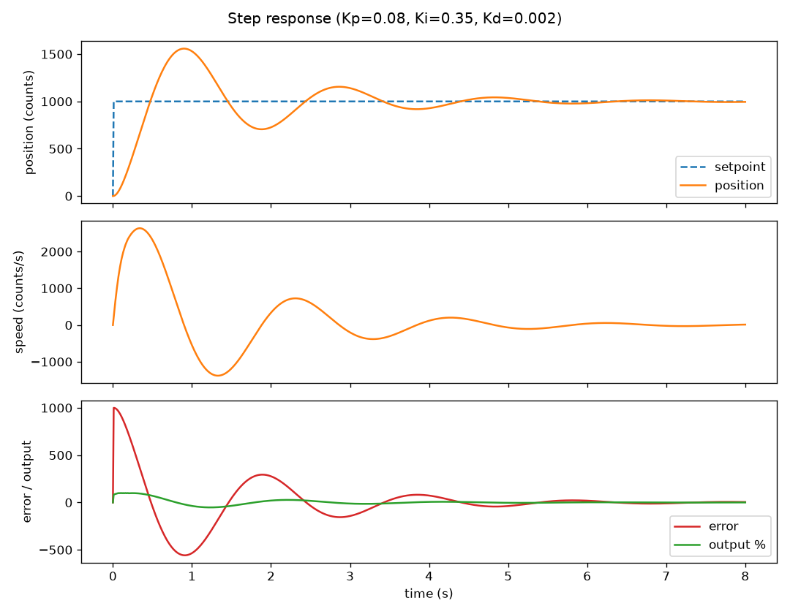

# PID-Based DC Motor Position / Speed Control System

A real-time closed-loop PID controller for DC motor position and speed
regulation, running on an STM32 microcontroller, paired with a Python
tuning and data-logging dashboard.

- **`firmware/`** — Embedded C control loop (STM32F103 "Blue Pill"):
  quadrature encoder feedback, PID control, H-bridge PWM output, and a
  serial telemetry/command link to the host.
- **`dashboard/`** — Python app that streams live telemetry, plots the
  step response and error curves in real time, exposes Kp/Ki/Kd and
  setpoint as live sliders, and logs every run to CSV.
- **`firmware/test/native/`** — A native (gcc) build of the *exact same*
  PID/protocol source that runs on the MCU, closed around a simulated
  DC motor plant. This is what lets the whole system be built and run
  end-to-end on a dev machine with no hardware attached.



## Architecture

```
                     UART (real HW)  or  stdio pipe (simulation)
                    ┌─────────────────────────────────────────────┐
                    │        line protocol (firmware/include/protocol.h)
                    │        T,...        telemetry, device -> host
                    │        K/S/M/E/R    commands,  host -> device
                    ▼                                             ▲
┌───────────────────────────────┐            ┌─────────────────────────────────┐
│  STM32F103 firmware            │            │  Python dashboard                │
│  main.c                        │            │  dashboard.py                    │
│   TIM2 encoder -> encoder.c    │            │   live plots (position, speed,   │
│   pid.c (PID core)             │◄──────────►│   error, output)                 │
│   TIM3 PWM -> motor.c          │            │   Kp/Ki/Kd + setpoint sliders    │
│   USART1 -> protocol.c         │            │   CSV logging                    │
└───────────────────────────────┘            └─────────────────────────────────┘
              ▲
              │ same pid.c / protocol.c, compiled natively
              ▼
┌───────────────────────────────┐
│  test/native/motor_sim         │   <- swap-in for real hardware,
│   motor_model.c (plant sim)    │      no MCU/toolchain required
│   sim_main.c                   │
└───────────────────────────────┘
```

The PID core (`pid.c`) and the serial protocol codec (`protocol.c`) are
plain, hardware-independent C. They're compiled twice: once into the
STM32 firmware, and once into `motor_sim`, a native binary that closes
the same control code around a simulated 2nd-order DC motor model
(`motor_model.c`, RK4-integrated). The dashboard talks to whichever one
it's given identically, since both speak the same line protocol.

## Quick start (no hardware required)

Build the native simulation:

```
cd firmware/test/native
make
```

Run the dashboard against it (opens a live plotting window with tuning
sliders):

```
cd dashboard
pip install -r requirements.txt
python3 dashboard.py --sim
```

Or capture a step response headlessly (useful over SSH / CI, no
display needed):

```
python3 dashboard.py --headless --duration 8 --setpoint 1000 \
    --plot-out step.png
```

## Running on real hardware

1. Wire an STM32F103C8 ("Blue Pill") to a TB6612FNG/L298N-style motor
   driver and a quadrature encoder motor per [docs/wiring.md](docs/wiring.md).
2. Flash the firmware:
   ```
   cd firmware
   pio run -t upload
   ```
3. Point the dashboard at the board's serial adapter instead of the
   simulation:
   ```
   python3 dashboard.py --port /dev/ttyUSB0
   ```

> The firmware was written against the standard STM32 HAL / CubeMX
> peripheral setup for this board, but hasn't been hardware- or
> toolchain-validated in this environment (no ARM cross-compiler or
> physical board available here). The control algorithm itself —
> `pid.c` — is validated by the native simulation above, since it is
> the identical source file linked into both builds.

## Control loop

- 100 Hz fixed-rate control tick (STM32: TIM4 interrupt; simulation:
  paced to the same rate).
- Standard PID with derivative-on-measurement (avoids derivative kick
  on setpoint steps) and clamped integrator anti-windup (the integral
  term stops accumulating once the unsaturated output would exceed the
  actuator's range).
- Two modes, switchable at runtime: **position hold** (encoder counts)
  and **speed hold** (encoder counts/sec).

## Serial protocol

Line-based ASCII, identical over real UART or the simulation's stdio
pipe (see `firmware/include/protocol.h`):

| Direction       | Line                              | Meaning                         |
|-----------------|------------------------------------|----------------------------------|
| host -> device  | `K,<kp>,<ki>,<kd>`                 | set PID gains                    |
| host -> device  | `S,<value>`                        | set setpoint                     |
| host -> device  | `M,<0\|1>`                          | set mode (0=position, 1=speed)   |
| host -> device  | `E,<0\|1>`                          | enable/disable motor output      |
| host -> device  | `R`                                | reset integrator + zero position |
| device -> host  | `T,<t_ms>,<mode>,<setpoint>,<position>,<speed>,<error>,<output>` | telemetry, once per tick |

## Repo layout

```
firmware/
  include/            pid.h, protocol.h, encoder.h, motor.h, HAL config
  src/                pid.c, protocol.c (portable) + encoder.c, motor.c,
                      main.c, stm32f1xx_it.c (STM32 HAL)
  test/native/        motor_model.c/.h, sim_main.c, Makefile -> motor_sim
  platformio.ini
dashboard/
  protocol.py         Python mirror of firmware/include/protocol.h
  serial_link.py      serial port / subprocess transport backends
  dashboard.py        live plotting + tuning UI + CSV logging
docs/
  wiring.md
```
